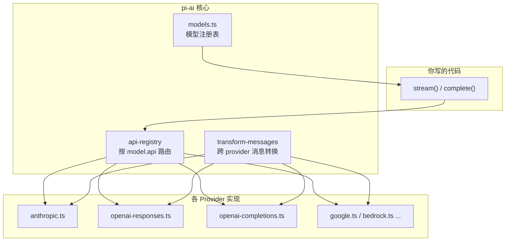

# `@earendil-works/pi-ai` 是什么？

一句话：**这是一个「统一的大模型调用层」**——不管你用的是 OpenAI、Anthropic、Google、Bedrock 还是本地 Ollama，都用同一套 API 去聊天、调工具、算 token 费用。

它是整个 `pi` monorepo 的底层基础设施，`packages/agent`（Agent 循环）和 `packages/coding-agent`（编程助手 CLI）都依赖它。

---

## 它解决什么问题？

各家大模型 API 长得不一样：

- OpenAI 有 Chat Completions 和 Responses 两套
- Anthropic 是 Messages API
- Google 是 Generative AI / Vertex AI
- 消息格式、工具调用、thinking/reasoning、流式事件各不相同

如果你自己写 Agent，每换一个 provider 就要重写一遍适配逻辑。`pi-ai` 把这些差异**藏在背后**，对外只暴露统一的概念：

- `Context`（对话上下文）
- `stream()` / `complete()`（流式 / 一次性回复）
- 统一的事件类型（文字、思考、工具调用）
- 统一的 token 和费用统计

---

## 核心概念（用大白话讲）

### 1. Provider（提供商）vs API（协议）

- **Provider**：你选哪家服务，比如 `openai`、`anthropic`、`google`、`groq`、`openrouter`……
- **API**：底层走哪种 HTTP 协议，比如 `openai-responses`、`anthropic-messages`、`google-generative-ai`

同一个 provider 下的模型，通常共用同一种 API。比如 Anthropic 的 Claude 都走 `anthropic-messages`；很多兼容 OpenAI 的小厂（Groq、xAI、DeepSeek 等）都走 `openai-completions`。

### 2. Model（模型）

每个模型是一份**元数据**，不只是 id 字符串，还包括：

- 上下文窗口多大
- 支不支持看图（vision）
- 支不支持 reasoning/thinking
- 输入/输出 token 单价
- 走哪个 API、baseUrl 是什么

```typescript
const model = getModel('openai', 'gpt-4o-mini');
// model.contextWindow, model.input, model.reasoning, model.cost ...
```

模型列表是脚本自动生成的（`scripts/generate-models.ts` → `models.generated.ts`），不用手写维护。

### 3. Context（对话上下文）

就是「这次请求要带什么给模型」：

```typescript
const context: Context = {
  systemPrompt: '你是助手',
  messages: [{ role: 'user', content: '你好' }],
  tools: [...]  // 可选：工具定义
};
```

`Context` 是普通 JSON 对象，可以 `JSON.stringify` 存数据库、读出来继续聊——**换模型也不用丢历史**。

### 4. 四种入口函数

| 函数 | 行为 | 适合场景 |
|------|------|----------|
| `stream()` | 流式，边生成边推事件 | TUI、打字机效果、实时显示工具参数 |
| `complete()` | 等流结束，直接拿完整消息 | 脚本、后台任务、不关心中间过程 |
| `streamSimple()` | 流式 + 简化 options（如 `reasoning: 'high'`） | 大多数 Agent 场景（`packages/agent` 默认用这个） |
| `completeSimple()` | 非流式 + 简化 options | 同上，但不要流 |

`complete()` 内部就是 `stream().result()` 的语法糖。不管 provider 是 OpenAI、Anthropic 还是 Groq，签名都一样：

```typescript
stream(model, context, options?)
complete(model, context, options?)
```

---

## 统一 API 调用方式（stream / complete）

### 第一步：选模型 + 拼 Context

```typescript
import { getModel, complete, stream, Type } from '@earendil-works/pi-ai';

// 1. 选模型（provider + modelId）
const model = getModel('openai', 'gpt-4o-mini');

// 2. 拼上下文
const context = {
  systemPrompt: '你是助手，回答要简洁。',
  messages: [
    { role: 'user', content: '1+1 等于几？', timestamp: Date.now() }
  ],
};
```

`Context` 就三块：

- `systemPrompt` — 系统提示（可选）
- `messages` — 对话历史
- `tools` — 工具定义（可选）

---

### 例子 1：最简单 — 一次性拿回复

```typescript
const reply = await complete(model, context);

// reply 是 AssistantMessage
for (const block of reply.content) {
  if (block.type === 'text') {
    console.log(block.text);
  }
}

console.log('用了多少 token:', reply.usage.input, reply.usage.output);
console.log('大概花了:', reply.usage.cost.total, '美元');
console.log('为什么停:', reply.stopReason); // 通常是 "stop"
```

多轮对话：把 assistant 回复 push 回去，再加 user 消息，继续 `complete`：

```typescript
context.messages.push(reply);
context.messages.push({
  role: 'user',
  content: '再解释一下为什么',
  timestamp: Date.now(),
});

const reply2 = await complete(model, context);
```

---

### 例子 2：流式 — 打字机效果

```typescript
const s = stream(model, context);

for await (const event of s) {
  switch (event.type) {
    case 'text_delta':
      process.stdout.write(event.delta);  // 一个字一个字打出来
      break;
    case 'done':
      console.log('\n生成结束，原因:', event.reason);
      break;
    case 'error':
      console.error('出错了:', event.error.errorMessage);
      break;
  }
}

// 流结束后拿完整消息（和 complete 返回值一样）
const finalMessage = await s.result();
context.messages.push(finalMessage);
```

流式返回的是 `AssistantMessageEventStream`，可以 `for await` 遍历，也可以 `await s.result()` 拿最终结果。

常见事件：

- `text_delta` — 文字片段
- `thinking_delta` — 思考过程（reasoning 模型）
- `toolcall_delta` — 工具参数片段
- `toolcall_end` — 工具调用完成
- `done` / `error` — 结束

---

### 例子 3：工具调用 — Agent 的核心循环

```typescript
import { getModel, stream, complete, Type } from '@earendil-works/pi-ai';

const model = getModel('anthropic', 'claude-sonnet-4-20250514');

const tools = [{
  name: 'get_weather',
  description: '查天气',
  parameters: Type.Object({
    city: Type.String({ description: '城市名' }),
  }),
}];

const context = {
  messages: [{ role: 'user', content: '北京今天天气怎么样？', timestamp: Date.now() }],
  tools,
};

// 第一轮：模型决定调工具
const response = await complete(model, context);
context.messages.push(response);

const toolCalls = response.content.filter(b => b.type === 'toolCall');

for (const call of toolCalls) {
  // 你自己执行工具（这里 mock）
  const weather = call.arguments.city === '北京' ? '晴，25°C' : '未知';

  // 把结果塞回 context
  context.messages.push({
    role: 'toolResult',
    toolCallId: call.id,
    toolName: call.name,
    content: [{ type: 'text', text: weather }],
    isError: false,
    timestamp: Date.now(),
  });
}

// 第二轮：模型根据工具结果生成最终回答
if (toolCalls.length > 0) {
  const final = await complete(model, context);
  console.log(final.content.find(b => b.type === 'text')?.text);
}
```

`stopReason === 'toolUse'` 表示模型在等工具结果。上层 `packages/agent` 的 `agentLoop` 就是把这段循环自动化。

流式版可以实时看工具参数怎么拼出来：

```typescript
const s = stream(model, context);

for await (const event of s) {
  if (event.type === 'toolcall_delta') {
    const call = event.partial.content[event.contentIndex];
    if (call.type === 'toolCall' && call.arguments?.city) {
      console.log('模型正在查:', call.arguments.city);  // 参数可能还不完整
    }
  }
  if (event.type === 'toolcall_end') {
    console.log('工具调用完成:', event.toolCall.name, event.toolCall.arguments);
  }
}
```

---

### 例子 4：换 Provider — 同一套 API

```typescript
// OpenAI
const gpt = getModel('openai', 'gpt-4o-mini');
await complete(gpt, context);

// Anthropic — 调用方式完全一样
const claude = getModel('anthropic', 'claude-sonnet-4-20250514');
await complete(claude, context);

// Groq — 也是同一套
const groq = getModel('groq', 'llama-3.3-70b-versatile');
await complete(groq, context);

// 本地 Ollama — 自定义 model 对象，仍然用 stream/complete
const ollama = {
  id: 'llama3',
  name: 'Llama 3 (Ollama)',
  api: 'openai-completions',
  provider: 'ollama',
  baseUrl: 'http://localhost:11434/v1',
  reasoning: false,
  input: ['text'],
  cost: { input: 0, output: 0, cacheRead: 0, cacheWrite: 0 },
  contextWindow: 128000,
  maxTokens: 32000,
};
await complete(ollama, context, { apiKey: 'dummy' });
```

`stream.ts` 会根据 `model.api` 自动路由到对应 provider 实现，你不用关心底层 HTTP 细节。

---

### 例子 5：Simple 版 — 一行开 thinking

完整版要传 provider 特有参数：

```typescript
// Anthropic 完整版
await complete(claude, context, {
  thinkingEnabled: true,
  thinkingBudgetTokens: 8192,
});

// OpenAI 完整版
await complete(gpt5, context, {
  reasoningEffort: 'medium',
});
```

Simple 版统一成一个字段：

```typescript
import { completeSimple, streamSimple } from '@earendil-works/pi-ai';

// 不管哪家 provider，都这样写
const reply = await completeSimple(model, context, {
  reasoning: 'high',  // 'minimal' | 'low' | 'medium' | 'high' | 'xhigh'
});

// 流式也一样
const s = streamSimple(model, context, { reasoning: 'medium' });
for await (const event of s) {
  if (event.type === 'thinking_delta') {
    process.stdout.write(event.delta);  // 看模型在想什么
  }
  if (event.type === 'text_delta') {
    process.stdout.write(event.delta);
  }
}
```

---

### 例子 6：Options 通用参数

第三个参数 `options` 各家都能用：

```typescript
const controller = new AbortController();
setTimeout(() => controller.abort(), 5000);  // 5 秒后取消

const reply = await complete(model, context, {
  apiKey: 'sk-...',           // 显式传 key（浏览器必须这样）
  temperature: 0.7,
  maxTokens: 4096,
  signal: controller.signal,  // 取消请求
  sessionId: 'chat-123',      // 部分 provider 用于 prompt cache
  cacheRetention: 'short',    // 'none' | 'short' | 'long'
  timeoutMs: 60_000,
  onPayload: (payload) => {   // 调试：看发给 provider 的原始请求
    console.log(JSON.stringify(payload, null, 2));
  },
});
```

Node.js 里设了环境变量（如 `OPENAI_API_KEY`）时，可以不传 `apiKey`，库会自动读。

---

### 例子 7：取消和中断后继续

```typescript
const controller = new AbortController();

const s = stream(model, context, { signal: controller.signal });

// 用户点了停止
controller.abort();

const partial = await s.result();
// partial.stopReason === 'aborted'
// partial.content 里有已生成的部分内容

// 可以把 partial 消息放进 context，让用户说「继续」
context.messages.push(partial);
context.messages.push({ role: 'user', content: '请继续', timestamp: Date.now() });

const continuation = await complete(model, context);
```

---

### 心智模型

```
getModel(provider, id)  →  Model 对象（告诉库走哪条路）
        ↓
Context { systemPrompt, messages, tools? }
        ↓
stream / complete / streamSimple / completeSimple
        ↓
AssistantMessageEventStream（流式）或 AssistantMessage（完整）
        ↓
读 content[]：text / thinking / toolCall
读 usage：token 和费用
读 stopReason：stop / toolUse / length / error / aborted
```

你要做的就三件事：选 model、拼 context、调 stream 或 complete。换 provider、加工具、开 thinking、取消请求，都是同一套接口上的参数变化。

---

## 统一消息格式（Context 可序列化、可跨 provider 传递）

`pi-ai` 把所有 provider 的对话都压成同一套 JSON 结构。你可以 `JSON.stringify(context)` 存数据库，换模型时 `JSON.parse` 读回来继续聊。

### 总览：Context 长什么样

```typescript
interface Context {
  systemPrompt?: string;   // 系统提示（可选，单独字段，不在 messages 里）
  messages: Message[];     // 对话历史（三种 role 见下）
  tools?: Tool[];          // 当前可用工具定义（可选）
}
```

消息只有三种 **role**：

| role | 谁发的 | 用途 |
|------|--------|------|
| `user` | 用户 / 你注入的指令 | 提问、发图片、steering |
| `assistant` | 模型 | 回复文字、思考过程、工具调用 |
| `toolResult` | 你的代码 | 工具执行结果（文字或图片） |

一条完整对话的典型顺序：

```
user → assistant（可能含 toolCall）→ toolResult → assistant → user → ...
```

---

### 1. UserMessage（用户消息）

```typescript
interface UserMessage {
  role: 'user';
  content: string | (TextContent | ImageContent)[];
  timestamp: number;  // Unix 毫秒时间戳
}
```

**纯文字**（最常见）：

```typescript
{
  role: 'user',
  content: '帮我写一个快速排序',
  timestamp: Date.now(),
}
```

**文字 + 图片**（vision 模型）：

```typescript
{
  role: 'user',
  content: [
    { type: 'text', text: '这张图里有什么？' },
    { type: 'image', data: '<base64 字符串>', mimeType: 'image/png' },
  ],
  timestamp: Date.now(),
}
```

注意：`content` 要么是**纯字符串**，要么是**内容块数组**，不要混用。

---

### 2. AssistantMessage（助手消息）

模型返回的消息，也是 `complete()` / `stream().result()` 的返回值。

```typescript
interface AssistantMessage {
  role: 'assistant';
  content: (TextContent | ThinkingContent | ToolCall)[];
  api: Api;              // 实际用的 API 协议，如 'anthropic-messages'
  provider: Provider;    // 如 'anthropic'
  model: string;         // 请求的 model id
  responseModel?: string; // 实际响应的 model（OpenRouter auto 路由时可能不同）
  responseId?: string;   // provider 侧的消息/响应 id（可选）
  usage: Usage;          // token 和费用
  stopReason: StopReason;
  errorMessage?: string; // stopReason 为 error/aborted 时有值
  timestamp: number;
}
```

`content` 是一个**有序数组**，可以同时包含多种块：

#### TextContent — 正文

```typescript
{ type: 'text', text: '快速排序的核心思想是分治……' }
```

#### ThinkingContent — 思考过程（reasoning 模型）

```typescript
{
  type: 'thinking',
  thinking: '用户要排序算法，我先解释思路再写代码……',
  thinkingSignature?: '...',  // provider 侧 id，多轮对话需要原样带回
  redacted?: false,            // true 表示被安全过滤器 redact 了
}
```

#### ToolCall — 工具调用

```typescript
{
  type: 'toolCall',
  id: 'call_abc123',           // 唯一 id，toolResult 要靠它关联
  name: 'read_file',
  arguments: { path: '/tmp/foo.ts' },
  thoughtSignature?: '...',   // Google 特有，多轮需原样带回
}
```

**完整 assistant 消息示例**（文字 + 思考 + 调工具）：

```typescript
{
  role: 'assistant',
  content: [
    { type: 'thinking', thinking: '需要先读文件再分析' },
    { type: 'text', text: '我先看一下这个文件。' },
    {
      type: 'toolCall',
      id: 'call_xyz',
      name: 'read_file',
      arguments: { path: 'src/index.ts' },
    },
  ],
  api: 'anthropic-messages',
  provider: 'anthropic',
  model: 'claude-sonnet-4-20250514',
  usage: {
    input: 1200,
    output: 85,
    cacheRead: 0,
    cacheWrite: 0,
    totalTokens: 1285,
    cost: { input: 0.0036, output: 0.0013, cacheRead: 0, cacheWrite: 0, total: 0.0049 },
  },
  stopReason: 'toolUse',  // 在等工具结果
  timestamp: 1718000000000,
}
```

#### stopReason 取值

| 值 | 含义 |
|----|------|
| `stop` | 正常结束 |
| `length` | 输出 token 到上限 |
| `toolUse` | 调了工具，等你回 toolResult |
| `error` | 请求出错 |
| `aborted` | 被 AbortSignal 取消 |

---

### 3. ToolResultMessage（工具结果）

你的代码执行完工具后，把结果塞回 context：

```typescript
interface ToolResultMessage {
  role: 'toolResult';
  toolCallId: string;   // 对应 assistant 里 toolCall.id
  toolName: string;     // 对应 toolCall.name
  content: (TextContent | ImageContent)[];
  details?: unknown;    // 给 UI/日志用的额外信息，不会发给模型
  isError: boolean;     // true 表示工具执行失败
  timestamp: number;
}
```

**文字结果**：

```typescript
{
  role: 'toolResult',
  toolCallId: 'call_xyz',
  toolName: 'read_file',
  content: [{ type: 'text', text: 'export function main() { ... }' }],
  isError: false,
  timestamp: Date.now(),
}
```

**文字 + 图片**（比如截图工具）：

```typescript
{
  role: 'toolResult',
  toolCallId: 'call_screenshot',
  toolName: 'take_screenshot',
  content: [
    { type: 'text', text: '页面截图如下' },
    { type: 'image', data: '<base64>', mimeType: 'image/png' },
  ],
  isError: false,
  timestamp: Date.now(),
}
```

**执行失败**：

```typescript
{
  role: 'toolResult',
  toolCallId: 'call_xyz',
  toolName: 'read_file',
  content: [{ type: 'text', text: 'ENOENT: no such file or directory' }],
  isError: true,
  timestamp: Date.now(),
}
```

---

### 4. Tool（工具定义）

放在 `Context.tools` 里，告诉模型有哪些工具可用：

```typescript
interface Tool {
  name: string;
  description: string;
  parameters: TSchema;  // TypeBox schema
}
```

示例：

```typescript
import { Type, StringEnum } from '@earendil-works/pi-ai';

const readFileTool: Tool = {
  name: 'read_file',
  description: '读取文件内容',
  parameters: Type.Object({
    path: Type.String({ description: '文件路径' }),
  }),
};

const calcTool: Tool = {
  name: 'math_operation',
  description: '四则运算',
  parameters: Type.Object({
    a: Type.Number(),
    b: Type.Number(),
    operation: StringEnum(['add', 'subtract', 'multiply', 'divide']),
  }),
};
```

---

### 5. 完整对话 Context 示例

下面是一段「用户提问 → 模型调工具 → 返回结果 → 模型最终回答」的完整 context：

```typescript
const context: Context = {
  systemPrompt: '你是编程助手，用工具读文件后再回答。',
  tools: [readFileTool],
  messages: [
    // ① 用户提问
    {
      role: 'user',
      content: 'src/index.ts 导出了什么？',
      timestamp: 1718000000000,
    },

    // ② 模型决定读文件（stopReason: toolUse）
    {
      role: 'assistant',
      content: [
        { type: 'text', text: '我先读一下文件。' },
        {
          type: 'toolCall',
          id: 'call_001',
          name: 'read_file',
          arguments: { path: 'src/index.ts' },
        },
      ],
      api: 'anthropic-messages',
      provider: 'anthropic',
      model: 'claude-sonnet-4-20250514',
      usage: { input: 500, output: 60, cacheRead: 0, cacheWrite: 0, totalTokens: 560, cost: { /* ... */ } },
      stopReason: 'toolUse',
      timestamp: 1718000001000,
    },

    // ③ 你的代码执行工具，塞回结果
    {
      role: 'toolResult',
      toolCallId: 'call_001',
      toolName: 'read_file',
      content: [{ type: 'text', text: 'export { stream, complete, getModel } from "./stream.ts";' }],
      isError: false,
      timestamp: 1718000002000,
    },

    // ④ 模型根据工具结果生成最终回答（stopReason: stop）
    {
      role: 'assistant',
      content: [
        { type: 'text', text: 'index.ts 导出了 stream、complete 和 getModel 三个函数。' },
      ],
      api: 'anthropic-messages',
      provider: 'anthropic',
      model: 'claude-sonnet-4-20250514',
      usage: { input: 620, output: 35, cacheRead: 0, cacheWrite: 0, totalTokens: 655, cost: { /* ... */ } },
      stopReason: 'stop',
      timestamp: 1718000003000,
    },
  ],
};
```

---

### 6. 序列化与跨 Provider 传递

**序列化**：整个 `Context` 是普通 JSON，直接存：

```typescript
const saved = JSON.stringify(context);
localStorage.setItem('chat', saved);

// 恢复
const restored: Context = JSON.parse(localStorage.getItem('chat')!);
```

图片是 base64 字符串，也会一起序列化（体积会变大）。

**换 Provider**：messages 不用改，只换 `getModel()` 的 provider：

```typescript
// 在 Claude 上聊了一半
let context = restored;

// 换到 GPT，同一份 context 直接传
const gpt = getModel('openai', 'gpt-5-mini');
const reply = await complete(gpt, context);
```

库内部的 `transformMessages()` 会自动处理兼容性：

- `user` / `toolResult` 消息**原样传递**
- 同 provider 的 `assistant` 消息**原样传递**
- 不同 provider 的 `assistant` 消息：`thinking` 块转成带 `<thinking>` 标签的 `text`
- `toolCall` id 可能被规范化（OpenAI 的长 id → Anthropic 允许的格式）
- 非 vision 模型收到图片时，自动替换成占位文字

所以你可以 Claude 开头、GPT 续写、Gemini 收尾，context 始终是同一份。

---

### 7. 内容块速查表

| 块类型 | type 字段 | 出现在 | 主要字段 |
|--------|-----------|--------|----------|
| 文字 | `text` | user / assistant / toolResult | `text` |
| 图片 | `image` | user / toolResult | `data`（base64）, `mimeType` |
| 思考 | `thinking` | assistant | `thinking`, `thinkingSignature?` |
| 工具调用 | `toolCall` | assistant | `id`, `name`, `arguments` |

| 消息 role | content 允许的类型 |
|-----------|-------------------|
| `user` | `string` 或 `(text \| image)[]` |
| `assistant` | `(text \| thinking \| toolCall)[]` |
| `toolResult` | `(text \| image)[]` |

---

## 统一事件流（文字、思考、工具调用同一套协议）

前面讲的 **Message** 是「最终成品」——一条完整的 assistant 消息。  
**事件流**是「制作过程」——模型还在生成时，一块一块推给你的增量更新。

不管底层是 Anthropic SSE、OpenAI Responses 还是 Google streaming，上层看到的都是同一套 `AssistantMessageEvent`。

### 为什么需要统一事件？

各家 provider 的原始流格式完全不同：

- Anthropic：`content_block_delta` + `text_delta` / `thinking_delta` / `input_json_delta`
- OpenAI Responses：`response.output_text.delta` / `response.function_call_arguments.delta`
- Google：`candidates[].content.parts[].text`

`pi-ai` 的每个 provider 实现负责**翻译**，统一 emit 成下面这套事件。你的 TUI / Agent 只写一次事件处理逻辑，换 provider 不用改 UI。

---

### 事件生命周期

一次 `stream()` 调用的事件顺序大致如下：

```
start                          ← 流开始，partial 是空的 assistant 消息骨架
  │
  ├─ thinking_start            ← 第 N 块：思考开始（reasoning 模型才有）
  ├─ thinking_delta × N        ← 思考内容片段
  ├─ thinking_end              ← 思考块完成
  │
  ├─ text_start                ← 第 M 块：正文开始
  ├─ text_delta × N            ← 正文字符片段
  ├─ text_end                  ← 正文块完成
  │
  ├─ toolcall_start            ← 第 K 块：工具调用开始
  ├─ toolcall_delta × N        ← 工具参数 JSON 片段（边传边解析）
  ├─ toolcall_end              ← 工具调用完成，arguments 已完整
  │
done                           ← 成功结束（或 error 表示失败/取消）
```

三种内容块（thinking / text / toolCall）共用同一套 **start → delta → end** 三段式，只是 `type` 前缀不同。

---

### 全部事件类型

| 事件 | 何时触发 | 关键字段 |
|------|----------|----------|
| `start` | 流开始 | `partial`：初始 assistant 消息（content 为空） |
| `text_start` | 一个 text 块开始 | `contentIndex` |
| `text_delta` | 收到文字片段 | `delta`（本次新增的文字）, `contentIndex` |
| `text_end` | text 块完成 | `content`（该块完整文字）, `contentIndex` |
| `thinking_start` | 一个 thinking 块开始 | `contentIndex` |
| `thinking_delta` | 收到思考片段 | `delta`, `contentIndex` |
| `thinking_end` | thinking 块完成 | `content`, `contentIndex` |
| `toolcall_start` | 一个 toolCall 块开始 | `contentIndex` |
| `toolcall_delta` | 收到参数 JSON 片段 | `delta`, `contentIndex` |
| `toolcall_end` | toolCall 完成 | `toolCall`（含完整 id/name/arguments）, `contentIndex` |
| `done` | 成功结束 | `reason`（stop/length/toolUse）, `message`（最终消息） |
| `error` | 失败或取消 | `reason`（error/aborted）, `error`（含 partial 内容的消息） |

**每个中间事件都带 `partial`**：当前为止拼出来的完整 `AssistantMessage`。你可以直接用 `event.partial` 刷新 UI，不用自己维护状态。

**`contentIndex`**：该块在 `partial.content[]` 数组里的下标。一个 assistant 消息可以有多个 text / thinking / toolCall 块，靠这个 index 区分。

---

### 例子 1：纯文字流

模型回复「Hello world」时，事件可能是：

```
start           partial.content = []
text_start      contentIndex = 0
text_delta      delta = "Hello"
text_delta      delta = " world"
text_end        content = "Hello world"
done            reason = "stop"
```

代码：

```typescript
const s = stream(model, context);

for await (const event of s) {
  switch (event.type) {
    case 'start':
      console.log('[开始生成]');
      break;
    case 'text_delta':
      process.stdout.write(event.delta);
      break;
    case 'done':
      console.log('\n[完成]', event.message.usage);
      break;
  }
}
```

---

### 例子 2：思考 + 正文（reasoning 模型）

模型先想再答，事件可能是：

```
start
thinking_start      contentIndex = 0
thinking_delta      delta = "用户问的是排序，"
thinking_delta      delta = "应该用快排……"
thinking_end        content = "用户问的是排序，应该用快排……"
text_start          contentIndex = 1
text_delta          delta = "快速排序"
text_delta          delta = "是一种分治算法……"
text_end
done                reason = "stop"
```

代码：分区域渲染「思考区」和「回答区」

```typescript
for await (const event of s) {
  switch (event.type) {
    case 'thinking_start':
      console.log('\n--- 思考 ---');
      break;
    case 'thinking_delta':
      process.stdout.write(event.delta);  // 思考区实时更新
      break;
    case 'thinking_end':
      console.log('\n--- 思考结束 ---\n');
      break;
    case 'text_delta':
      process.stdout.write(event.delta);  // 回答区实时更新
      break;
  }
}
```

也可以用 `event.partial` 一次性拿当前全貌：

```typescript
if (event.type === 'text_delta' || event.type === 'thinking_delta') {
  const msg = event.partial;
  const thinking = msg.content.filter(b => b.type === 'thinking').map(b => b.thinking).join('');
  const text = msg.content.filter(b => b.type === 'text').map(b => b.text).join('');
  renderUI({ thinking, text });  // 刷新整个 UI
}
```

---

### 例子 3：工具调用流（partial JSON）

模型决定调 `read_file`，参数 `{ "path": "src/index.ts" }` 边传边拼：

```
start
text_start          contentIndex = 0
text_delta          delta = "我先读文件。"
text_end
toolcall_start      contentIndex = 1    partial.content[1] = { type:'toolCall', name:'read_file', arguments:{} }
toolcall_delta      delta = '{"path"'
toolcall_delta      delta = ': "src/index.ts"}'
toolcall_end        toolCall = { id:'call_abc', name:'read_file', arguments:{ path:'src/index.ts' } }
done                reason = "toolUse"
```

`toolcall_delta` 期间，`event.partial.content[contentIndex].arguments` 是**尽力解析的 partial JSON**：

```typescript
for await (const event of s) {
  if (event.type === 'toolcall_delta') {
    const call = event.partial.content[event.contentIndex];
    if (call.type === 'toolCall') {
      // arguments 可能还不完整，要做防御性判断
      if (call.arguments?.path) {
        console.log('正在读取:', call.arguments.path);
      }
    }
  }

  if (event.type === 'toolcall_end') {
    // 这里 arguments 完整了（但还没做 schema 校验）
    console.log('工具就绪:', event.toolCall.name, event.toolCall.arguments);
  }
}
```

注意：Google provider 不支持 function call streaming，只会发**一个** `toolcall_delta`（参数一次性到齐）。

---

### 例子 4：事件可能交错（interleaved）

不同块的事件**不保证连续**。Provider 一个 chunk 里可能同时有 text 和 toolcall，事件会交错：

```
text_start          contentIndex = 0
text_delta          delta = "好的，"
toolcall_start      contentIndex = 1    ← 正文还没结束，工具块就开始了
text_delta          delta = "我来写文件。"
toolcall_delta      delta = '{"path":'
text_end            contentIndex = 0
toolcall_delta      delta = '"out.txt"}'
toolcall_end        contentIndex = 1
done
```

处理规则：

1. **永远用 `contentIndex` 定位块**，不要假设 text 的 start/delta/end 会连续出现
2. **不要假设块按顺序完成**——text_end 可能在 toolcall_start 之后
3. **用 `partial` 做 UI 状态**——它比手动拼 delta 更可靠

---

### 例子 5：用 partial 驱动 TUI（agent 层的做法）

`packages/agent` 的 `agentLoop` 就是这样消费事件流的：

```typescript
let partialMessage: AssistantMessage | null = null;

for await (const event of s) {
  switch (event.type) {
    case 'start':
      partialMessage = event.partial;
      ui.onMessageStart(partialMessage);
      break;

    case 'text_delta':
    case 'thinking_delta':
    case 'toolcall_delta':
    case 'text_start':
    case 'thinking_start':
    case 'toolcall_start':
    case 'text_end':
    case 'thinking_end':
    case 'toolcall_end':
      partialMessage = event.partial;       // 每次更新都用最新的 partial
      ui.onMessageUpdate(event, partialMessage);
      break;

    case 'done':
    case 'error': {
      const finalMessage = await s.result();
      ui.onMessageEnd(finalMessage);
      break;
    }
  }
}
```

核心思路：**中间态靠 `event.partial` 刷新，最终态靠 `await s.result()` 拿**。

---

### 例子 6：错误与取消

请求失败或被 abort 时，流以 `error` 事件结束，但 partial 内容仍然保留：

```typescript
const controller = new AbortController();

const s = stream(model, context, { signal: controller.signal });

for await (const event of s) {
  if (event.type === 'text_delta') {
    process.stdout.write(event.delta);
  }
  if (event.type === 'error') {
    console.log('\n中断原因:', event.reason);           // 'aborted' 或 'error'
    console.log('已生成部分:', event.error.content);    // partial 内容还在
  }
}

const msg = await s.result();
// msg.stopReason === 'aborted'
// msg.content 里有中断前已生成的文字
```

---

### 事件 vs 最终 Message 的关系

```
流式事件（过程）                    最终 Message（结果）
─────────────────                  ─────────────────────
start                              │
text_start / text_delta / text_end  →  content[0]: { type:'text', text:'...' }
thinking_start / ... / thinking_end →  content[1]: { type:'thinking', thinking:'...' }
toolcall_start / ... / toolcall_end →  content[2]: { type:'toolCall', id, name, arguments }
done.message                       =  完整的 AssistantMessage
```

- 不想处理流？用 `complete()`，直接拿 `done.message`，跳过所有中间事件
- 要做 TUI / 实时 UI？用 `stream()` + 事件
- 两者最终得到的 `AssistantMessage` **结构完全一样**，可以直接 push 进 `context.messages`

---

## 统一计量（token 和费用自动算）

每次 `stream()` / `complete()` 返回的 `AssistantMessage` 都带一个 `usage` 字段。不管哪家 provider，结构完全一样——token 数和美元费用都帮你算好了。

### Usage 结构

```typescript
interface Usage {
  input: number;        // 普通输入 token（不含 cache）
  output: number;       // 输出 token（含 thinking/reasoning 输出）
  cacheRead: number;    // 从 prompt cache 命中的 token
  cacheWrite: number;   // 写入 prompt cache 的 token
  totalTokens: number;  // 上面四项之和
  cost: {
    input: number;      // 输入费用（美元）
    output: number;     // 输出费用（美元）
    cacheRead: number;  // cache 读取费用（美元）
    cacheWrite: number; // cache 写入费用（美元）
    total: number;      // 总费用（美元）
  };
}
```

关系：

```
totalTokens = input + output + cacheRead + cacheWrite
cost.total  = cost.input + cost.output + cost.cacheRead + cost.cacheWrite
```

---

### 费用从哪来？

每个 `Model` 对象自带单价（**美元 / 百万 token**）：

```typescript
const model = getModel('anthropic', 'claude-sonnet-4-20250514');

model.cost = {
  input: 3,       // $3 / 1M input tokens
  output: 15,     // $15 / 1M output tokens
  cacheRead: 0.3, // $0.3 / 1M cache read tokens
  cacheWrite: 3.75,// $3.75 / 1M cache write tokens
};
```

Provider 返回原始 token 计数后，库调用 `calculateCost()` 自动算钱：

```typescript
// packages/ai/src/models.ts
cost.input      = (model.cost.input / 1_000_000) * usage.input
cost.output     = (model.cost.output / 1_000_000) * usage.output
cost.cacheRead  = (model.cost.cacheRead / 1_000_000) * usage.cacheRead
cost.cacheWrite = (model.cost.cacheWrite / 1_000_000) * usage.cacheWrite
cost.total      = 四项之和
```

你不需要自己查价目表，也不需要写 `(tokens / 1000) * price` 这种公式。

---

### 例子 1：读单条消息的 usage

```typescript
const reply = await complete(model, context);

console.log('输入 token:', reply.usage.input);
console.log('输出 token:', reply.usage.output);
console.log('总 token:', reply.usage.totalTokens);
console.log('本次费用: $', reply.usage.cost.total.toFixed(6));
```

一次典型的 Claude Sonnet 4 短回复可能长这样：

```typescript
reply.usage = {
  input: 1200,
  output: 85,
  cacheRead: 0,
  cacheWrite: 0,
  totalTokens: 1285,
  cost: {
    input: 0.0036,    // 1200 × $3/1M
    output: 0.001275, // 85 × $15/1M
    cacheRead: 0,
    cacheWrite: 0,
    total: 0.004875,  // ≈ 0.49 美分
  },
};
```

---

### 例子 2：累加多轮对话的总费用

Agent 场景下，每轮 assistant 消息都有自己的 `usage`，你可以自己累加：

```typescript
let sessionUsage = { input: 0, output: 0, cacheRead: 0, cacheWrite: 0, totalCost: 0 };

async function ask(context: Context) {
  const reply = await complete(model, context);
  context.messages.push(reply);

  sessionUsage.input += reply.usage.input;
  sessionUsage.output += reply.usage.output;
  sessionUsage.cacheRead += reply.usage.cacheRead;
  sessionUsage.cacheWrite += reply.usage.cacheWrite;
  sessionUsage.totalCost += reply.usage.cost.total;

  console.log(`本轮: $${reply.usage.cost.total.toFixed(4)} | 累计: $${sessionUsage.totalCost.toFixed(4)}`);
  return reply;
}

// 多轮
await ask(context);
await ask(context);
await ask(context);
console.log('会话总计:', sessionUsage);
```

也可以遍历 `context.messages` 里所有 assistant 消息求和：

```typescript
function sumUsage(messages: Message[]) {
  return messages
    .filter((m): m is AssistantMessage => m.role === 'assistant')
    .reduce(
      (acc, m) => ({
        input: acc.input + m.usage.input,
        output: acc.output + m.usage.output,
        cacheRead: acc.cacheRead + m.usage.cacheRead,
        cacheWrite: acc.cacheWrite + m.usage.cacheWrite,
        totalCost: acc.totalCost + m.usage.cost.total,
      }),
      { input: 0, output: 0, cacheRead: 0, cacheWrite: 0, totalCost: 0 },
    );
}
```

---

### 例子 3：Prompt Cache 怎么体现在 usage 里

长 system prompt 在多轮对话中会被 cache。第二轮起，相同前缀的 token 走 `cacheRead`，比 `input` 便宜很多。

以 Claude Sonnet 4 为例（cache read 单价是 input 的 1/10）：

```
第一轮（写入 cache）:
  input: 5000, cacheWrite: 4500, cacheRead: 0
  cost.input:      5000 × $3/1M   = $0.015
  cost.cacheWrite: 4500 × $3.75/1M = $0.016875

第二轮（命中 cache）:
  input: 200, cacheRead: 4500, cacheWrite: 0
  cost.input:     200  × $3/1M  = $0.0006
  cost.cacheRead: 4500 × $0.3/1M = $0.00135   ← 比按 input 价算便宜 10 倍
```

代码里启用 cache 靠 `sessionId` + `cacheRetention`：

```typescript
const reply = await complete(model, context, {
  sessionId: 'my-session-123',
  cacheRetention: 'short',  // 'none' | 'short' | 'long'
});

console.log('cache read:', reply.usage.cacheRead);
console.log('cache write:', reply.usage.cacheWrite);
console.log('cache 省了:', reply.usage.cost.cacheRead, '美元');
```

不同 provider 对 cache 的支持和字段映射不同，但上层看到的始终是统一的 `cacheRead` / `cacheWrite`。

---

### 例子 4：流式过程中 usage 何时可用

Token 统计在流结束时才完整，但部分 provider 会**提前**推送 usage（如 Anthropic 在 `message_start` 就带 input token 数）。

通用做法：

```typescript
const s = stream(model, context);

for await (const event of s) {
  if (event.type === 'text_delta') {
    process.stdout.write(event.delta);
  }
  // 中间态的 event.partial.usage 可能还不完整
}

const final = await s.result();
// final.usage 是完整的
console.log('最终 token:', final.usage.totalTokens);
console.log('最终费用: $', final.usage.cost.total.toFixed(6));
```

**中断/出错时**：已生成的 partial 内容仍保留，usage 可能是部分值或全 0（取决于 provider 是否在 abort 前上报了 usage）。OpenAI 类 provider 通常 abort 后 usage 为 0；Anthropic / Google 可能在 abort 前就有 input token 统计。

---

### 例子 5：估算上下文占用（totalTokens 的用途）

`totalTokens` 表示**这次请求处理的总 token 量**，可用于估算下一轮请求的上下文大小：

```typescript
const reply = await complete(model, longContext);

// 这次请求消耗的总 token
console.log('本次总 token:', reply.usage.totalTokens);

// 估算当前 context 已占多少（所有 assistant 消息的 totalTokens 之和 + 最新 input）
// 上层 coding-agent 会据此做 context 压缩/截断决策
```

`totalTokens` 的计算方式因 provider 而异（有的用原生 `total_tokens` 字段，Anthropic 用四项之和），但 pi-ai 保证 **`totalTokens === input + output + cacheRead + cacheWrite`**。

---

### 例子 6：本地 / 免费模型

Ollama 等本地模型的 `model.cost` 全为 0：

```typescript
const ollama = {
  id: 'llama3',
  api: 'openai-completions',
  provider: 'ollama',
  baseUrl: 'http://localhost:11434/v1',
  cost: { input: 0, output: 0, cacheRead: 0, cacheWrite: 0 },
  // ...
};

const reply = await complete(ollama, context);
console.log(reply.usage.totalTokens);  // 仍有 token 计数
console.log(reply.usage.cost.total);   // 0
```

Token 数仍然统计（方便你看上下文占用），费用为 0。

---

### 例子 7：手动调用 calculateCost

如果你自己构造了 `usage`（比如测试、离线分析），可以用导出的 `calculateCost`：

```typescript
import { getModel, calculateCost } from '@earendil-works/pi-ai';

const model = getModel('openai', 'gpt-4o-mini');

const usage = {
  input: 1000,
  output: 500,
  cacheRead: 2000,
  cacheWrite: 0,
  totalTokens: 3500,
  cost: { input: 0, output: 0, cacheRead: 0, cacheWrite: 0, total: 0 },
};

calculateCost(model, usage);
console.log(usage.cost.total);  // 按 gpt-4o-mini 单价算出的美元费用
```

---

### 各 provider 的 token 来源（底层差异，上层无感）

| Provider | token 数据来源 | cache 字段 |
|----------|---------------|------------|
| Anthropic | `input_tokens`, `output_tokens`, `cache_read_input_tokens`, `cache_creation_input_tokens` | cacheRead + cacheWrite |
| OpenAI Responses | `input_tokens`, `output_tokens`, `input_tokens_details.cached_tokens` | 仅 cacheRead |
| Google | `promptTokenCount`, `candidatesTokenCount`, `cachedContentTokenCount` | 仅 cacheRead |
| OpenAI Completions | `prompt_tokens`, `completion_tokens`, `prompt_tokens_details.cached_tokens` | 仅 cacheRead |
| 其他 OpenAI 兼容 | 各自的 usage 字段 | 视 provider 而定 |

这些差异在 provider 实现层消化，你拿到的永远是统一的 `Usage`。

---

### 速查

| 字段 | 含义 | 典型用途 |
|------|------|----------|
| `usage.input` | 非 cache 的输入 token | 计费、上下文估算 |
| `usage.output` | 输出 token（含 thinking） | 计费 |
| `usage.cacheRead` | cache 命中 token | 看 cache 效果、计费 |
| `usage.cacheWrite` | cache 写入 token | 看首轮 cache 成本 |
| `usage.totalTokens` | 四项之和 | 上下文窗口占用估算 |
| `usage.cost.total` | 美元总费用 | 显示给用户、预算控制 |

---

## 专注 Agent：只收录支持 tool calling 的模型

### 大白话：聊天机器人和 Agent 的区别

**普通聊天**：你问一句，模型答一句，来回聊。模型只会「说话」，不能碰你的电脑。

**Agent**：模型除了说话，还能**动手**——读文件、跑命令、搜网页、改代码。它不会自己执行，而是说「我要调 `read_file`，路径是 `src/index.ts`」，你的程序去执行，把结果喂回去，它再继续。

这个「模型说我要用什么工具、参数是什么」的能力，就叫 **tool calling**（也叫 function calling）。

`pi-ai` 的定位是 **Agent 的 LLM 层**，不是通用聊天 SDK。所以它：

1. **模型清单只收录支持 tool calling 的模型**（生成脚本里 `tool_call !== true` 的直接跳过）
2. **消息格式里专门有 `toolCall` 和 `toolResult` 两种角色**
3. **流式事件里有完整的 toolcall_start/delta/end**
4. **stopReason 有 `toolUse`**，表示「我在等工具结果，还没说完」

上层 `packages/agent` 的 `agentLoop`、`packages/coding-agent` 的 `pi` CLI，都假设模型能调工具。

---

### 没有 tool calling 会怎样？

假设用一个**不支持工具**的模型做 coding agent：

```
用户: 帮我看看 package.json 里有哪些依赖

模型: 你可以打开 package.json 文件，里面 dependencies 字段列出了所有依赖……
      （只会告诉你怎么做，不会自己去读）
```

支持 tool calling 的模型：

```
用户: 帮我看看 package.json 里有哪些依赖

模型: [调用 read_file({ path: "package.json" })]
你的程序: 执行 read_file，返回文件内容
模型: 你的项目依赖了 typebox、vitest、openai 等……
      （真的读了文件再回答）
```

Agent 的核心循环就是：**模型调工具 → 你执行 → 结果塞回去 → 模型继续**。没有 tool calling，这个循环转不起来。

---

### 模型清单怎么筛的？

`scripts/generate-models.ts` 从 models.dev 等来源拉模型元数据，**只保留 `tool_call: true` 的**：

```typescript
// 伪代码，实际在 generate-models.ts 里每个 provider 都这样过滤
for (const [modelId, model] of Object.entries(provider.models)) {
  if (model.tool_call !== true) continue;  // 不支持工具？跳过，不进清单
  models.push(/* ... */);
}
```

所以你在 `getModels('openai')` 里看到的，都是能调工具的。一些只擅长纯文本、不支持 function calling 的模型**不会出现在列表里**。

例外情况：有些模型名义支持 tool calling，但有已知 bug 会被额外排除，比如 Bedrock 上某些 streaming 模式不稳定的型号。

---

### Agent 循环长什么样？

`pi-ai` 提供 primitives，`packages/agent` 拼成完整循环：

```
┌─────────────────────────────────────────────────┐
│  1. 用户发消息                                     │
│  2. stream(model, context)  → 模型回复             │
│  3. stopReason === 'toolUse' ?                    │
│     ├─ 是 → 执行工具 → toolResult 塞回 context     │
│     │       → 回到步骤 2                           │
│     └─ 否 → 结束这一轮                              │
└─────────────────────────────────────────────────┘
```

代码层面（简化版）：

```typescript
import { getModel, complete, Type } from '@earendil-works/pi-ai';

const model = getModel('anthropic', 'claude-sonnet-4-20250514');

const tools = [{
  name: 'read_file',
  description: '读取文件内容',
  parameters: Type.Object({
    path: Type.String({ description: '文件路径' }),
  }),
}];

const context = {
  systemPrompt: '你是编程助手，用工具读文件后再回答。',
  tools,
  messages: [
    { role: 'user', content: 'package.json 有哪些依赖？', timestamp: Date.now() },
  ],
};

// 第一轮：模型决定调工具
let reply = await complete(model, context);
context.messages.push(reply);

while (reply.stopReason === 'toolUse') {
  // 取出所有 toolCall
  const toolCalls = reply.content.filter(b => b.type === 'toolCall');

  for (const call of toolCalls) {
    // 你的代码执行工具（这里 mock）
    const content = call.name === 'read_file'
      ? `[mock] dependencies: { "typebox": "1.x", "vitest": "3.x" }`
      : 'unknown tool';

    context.messages.push({
      role: 'toolResult',
      toolCallId: call.id,
      toolName: call.name,
      content: [{ type: 'text', text: content }],
      isError: false,
      timestamp: Date.now(),
    });
  }

  // 第二轮：模型根据工具结果继续
  reply = await complete(model, context);
  context.messages.push(reply);
}

// 最终 stopReason === 'stop'，模型给出了完整回答
console.log(reply.content.find(b => b.type === 'text')?.text);
```

真实项目里不用手写这个循环——`agentLoop()` 帮你做了，还加了并行/串行执行、参数校验、steering 等。

---

### coding-agent 里工具长什么样？

`pi` CLI 内置的工具就是靠 tool calling 驱动的，例如：

| 工具名 | 干什么 |
|--------|--------|
| `read` | 读文件 |
| `write` | 写文件 |
| `edit` | 编辑文件 |
| `bash` | 跑 shell 命令 |
| `grep` | 搜索代码 |

用户说「帮我把 README 里的安装命令改一下」，模型不是凭空编答案，而是：

```
1. toolCall: read({ path: "README.md" })
2. toolResult: （文件内容）
3. toolCall: edit({ path: "README.md", oldText: "...", newText: "..." })
4. toolResult: （编辑成功）
5. text: "已经更新了 README 里的安装命令。"
```

你在 TUI 里看到的「模型正在读文件 / 正在跑命令」，就是 tool calling 流式事件（`toolcall_delta`）的实时展示。

---

### 一次请求里可以调多个工具

模型可以在一条 assistant 消息里发出**多个 toolCall**：

```typescript
{
  role: 'assistant',
  content: [
    { type: 'toolCall', id: 'call_1', name: 'read_file', arguments: { path: 'a.ts' } },
    { type: 'toolCall', id: 'call_2', name: 'read_file', arguments: { path: 'b.ts' } },
  ],
  stopReason: 'toolUse',
}
```

`agentLoop` 可以并行或串行执行这些工具，每个都对应一条 `toolResult`，然后一起塞回 context 让模型继续。

---

### 什么模型进不了清单？

| 情况 | 例子 | 在 pi-ai 里？ |
|------|------|--------------|
| 不支持 function calling | 某些纯文本小模型、早期 embedding 类模型 | 不在清单 |
| 只生成图片 | Gemini Flash Image、DALL-E 类 | 走单独的 `generateImages()` API，不进聊天模型清单 |
| 支持 tool calling | GPT-4o、Claude Sonnet、Gemini Flash、Llama 3.1+ | 在清单里 |
| 本地 Ollama 模型 | 取决于你拉的模型是否支持 tools | 可手动配 custom model |

聊天和画图是两条路：

- **聊天 + 工具** → `stream()` / `complete()` + `Context.tools`
- **生图** → `generateImages()` + `getImageModel()`（不参与 tool calling）

---

### 自定义模型也可以

清单是预生成的，但你可以手动加一个支持 tool calling 的本地模型：

```typescript
const myModel: Model<'openai-completions'> = {
  id: 'my-local-model',
  name: 'My Local Model',
  api: 'openai-completions',
  provider: 'ollama',
  baseUrl: 'http://localhost:11434/v1',
  reasoning: false,
  input: ['text'],
  cost: { input: 0, output: 0, cacheRead: 0, cacheWrite: 0 },
  contextWindow: 128000,
  maxTokens: 32000,
};

// 只要底层 API 支持 function calling，就能调工具
const reply = await complete(myModel, context, { apiKey: 'dummy' });
```

前提：Ollama / vLLM 等本地服务**本身得支持 tools API**。不支持的话，模型只会聊天，Agent 循环跑不起来。

---

### 和「纯聊天」用法兼容吗？

兼容。不传 `tools` 就是普通对话：

```typescript
const context = {
  messages: [{ role: 'user', content: '写一首关于代码的诗', timestamp: Date.now() }],
  // 没有 tools 字段
};

const reply = await complete(model, context);
// stopReason === 'stop'，正常文本回复，不会调工具
```

模型**有能力**调工具，但这次你没给它工具，它就只聊天。就像给程序员一把锤子，他也可以只用来敲键盘。

---

### 工具定义：TypeBox schema

工具用 **TypeBox** 定义参数，带类型检查和校验：

```typescript
const tools: Tool[] = [{
  name: 'get_time',
  description: '获取当前时间',
  parameters: Type.Object({
    timezone: Type.Optional(Type.String())
  })
}];
```

`agentLoop` 会在执行前用 `validateToolArguments` 校验参数；校验失败会把错误作为 `toolResult`（`isError: true`）还给模型，让它重试。

流式过程中，工具参数**边传边解析**（partial JSON），UI 可以实时显示「模型正在写哪个文件路径」。详见上文 [统一事件流](#统一事件流文字思考工具调用同一套协议) 一节。

---

### 一句话总结

`pi-ai` 不是给「你问我答」的聊天应用准备的，而是给 **「模型能调工具、能循环执行、能改文件跑命令」** 的 Agent 准备的。模型清单、消息格式、事件流、stopReason 全都围绕 tool calling 设计——这是它和普通 OpenAI SDK 封装最大的区别。

---

## 架构上怎么组织的？

可以把它想成三层：



1. **入口层**（`stream.ts`）：根据 `model.api` 从 registry 找对应 provider，自动补环境变量里的 API key。
2. **Provider 层**（`src/providers/`）：每个文件负责一种 API 协议——把 `Context` 转成各家格式，解析 SSE 流，emit 统一事件。
3. **模型层**（`models.generated.ts`）：预置几十家 provider 的模型清单。

新增 provider 的流程在 README 里写得很清楚：改 types → 写 provider 实现 → 注册到 registry → 生成模型 → 写测试。

---

## 几个很实用的高级能力

### 跨 Provider 换模型（Handoff）

对话中途可以从 Claude 换到 GPT，再换到 Gemini，**上下文不用重建**。

不同 provider 的 assistant 消息会自动转换：比如 Claude 的 thinking 块，发给 OpenAI 时会变成带 `<thinking>` 标签的普通文本。

### Token 和费用追踪

每条 assistant 消息自带 `usage`（token 数 + 美元费用），详见上文 [统一计量](#统一计量token-和费用自动算) 一节。

### Reasoning / Thinking 统一接口

各家「深度思考」配置不同，但你可以用：

```typescript
completeSimple(model, context, { reasoning: 'high' })
```

库会根据 provider 映射成对应参数（Anthropic thinking budget、OpenAI reasoning_effort、Gemini thinking config 等）。

### 图片

- **输入**：vision 模型可在 user/toolResult 消息里带 base64 图片
- **生成**：单独的 `generateImages()` API（目前主要是 OpenRouter），和聊天 API 分开

### OAuth 登录

GitHub Copilot、OpenAI Codex、Anthropic 订阅等不走普通 API key，需要 OAuth：

```bash
npx @earendil-works/pi-ai login anthropic
```

或通过 `@earendil-works/pi-ai/oauth` 编程式登录。

### 测试用的 Faux Provider

`registerFauxProvider()` 可以注册一个**假模型**，按脚本返回预设回复，不花真 API 钱，专门给测试和 demo 用。

---

## 支持的 Provider 有多广？

官方列表里有 30+ 家，大致分几类：

| 类型 | 例子 |
|------|------|
| 一线大厂 | OpenAI、Anthropic、Google、Azure、Amazon Bedrock |
| 聚合/网关 | OpenRouter、Vercel AI Gateway、Cloudflare |
| 推理加速 | Groq、Cerebras、Fireworks、Together |
| 国内/区域 | ZAI、MiniMax、Kimi、Xiaomi MiMo |
| 订阅 OAuth | GitHub Copilot、OpenAI Codex |
| 本地/自建 | Ollama、vLLM、LM Studio（OpenAI 兼容模式） |

OpenAI 兼容的服务最多，通过 `compat` 字段处理各家的细微差异（比如是否支持 `developer` role、`reasoning_effort` 等）。

---

## 典型使用流程（Agent 场景）

```
1. getModel('anthropic', 'claude-sonnet-4-...')  → 选模型
2. 构建 Context（systemPrompt + messages + tools）
3. stream(model, context)  → 流式拿回复
4. 如果模型调了工具：
   - 执行工具
   - 把 toolResult 消息 push 进 context.messages
   - 再 stream/complete 继续
5. 需要换模型？直接换 model，context 不变
6. 需要持久化？JSON.stringify(context) 存起来
```

这就是上层 `packages/agent` 的 `agentLoop` 所做的事情——`pi-ai` 负责「怎么跟模型说话」，`agent` 负责「怎么循环调工具」。

---

## 目录结构速览

```
packages/ai/
├── src/
│   ├── index.ts          # 主入口，导出所有公开 API
│   ├── stream.ts         # stream/complete 入口
│   ├── models.ts         # getModel/getProviders
│   ├── types.ts          # Context、Message、Tool 等核心类型
│   ├── api-registry.ts   # Provider 注册表
│   ├── models.generated.ts   # 自动生成的模型清单
│   ├── providers/        # 各 API 协议的具体实现
│   │   ├── anthropic.ts
│   │   ├── openai-completions.ts
│   │   ├── openai-responses.ts
│   │   ├── google.ts
│   │   └── ...
│   └── utils/            # OAuth、校验、JSON 解析等工具
├── scripts/
│   ├── generate-models.ts      # 从 models.dev 拉模型数据
│   └── generate-image-models.ts
└── test/                 # 大量 provider 兼容性测试
```

---

## 总结

`pi-ai` 不是又一个 OpenAI SDK 封装，而是一个**面向 Agent 开发的统一 LLM 层**：

- **统一 API**：一套 `stream`/`complete` 打遍天下
- **统一消息格式**：`Context` 可序列化、可跨 provider 传递
- **统一事件流**：文字、思考、工具调用用同一套事件
- **统一计量**：token 和费用自动算
- **专注 Agent**：只收录支持 tool calling 的模型，详见 [专注 Agent](#专注-agent只收录支持-tool-calling-的模型) 一节

如果你要在这个 monorepo 里写 Agent 相关功能，几乎都会先经过这一层。上层 `coding-agent` 的 CLI、`agent` 的循环逻辑，都是站在 `pi-ai` 肩膀上的。
