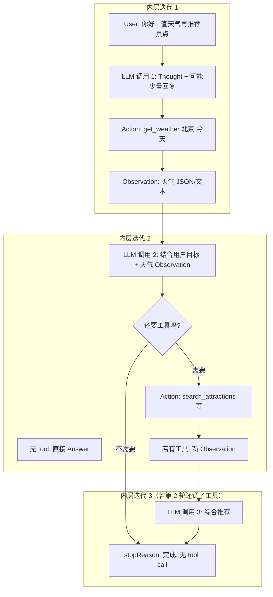
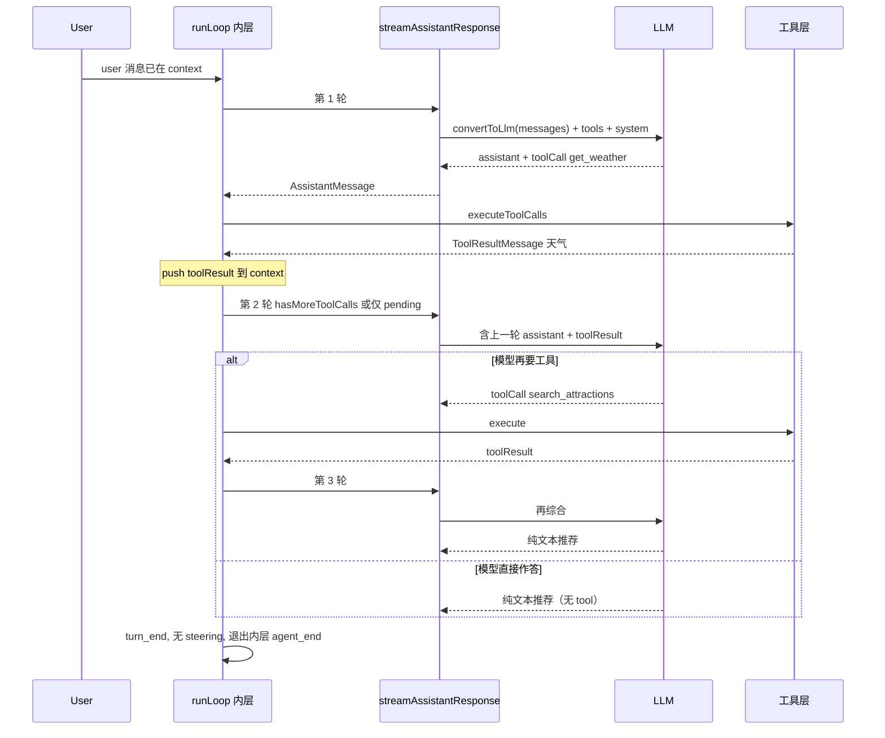

下面把 **ReAct 思想**、**你这个多步任务的对话形态**，和 **`runLoop` 里「一次 assistant 调用」与「上下文如何变厚」** 对齐说明，并配几张图。

---

## 1. ReAct 在论文里是什么样

经典 ReAct 是循环三步：

| 论文里的名字 | 含义 |
|--------------|------|
| **Thought** | 模型用自然语言推演「该做什么」 |
| **Action** | 选一个可调用动作（本仓库里通常是 **tool call**，带函数名与参数） |
| **Observation** | 环境执行动作后的结果（这里是 **tool result 消息** 写回对话） |

下一轮再用 **Thought + Action**，直到模型不再发起 Action，而是直接给出最终 **Answer**（纯文本）。

要点：**Observation 不靠模型「回忆」**，而是**显式写进下一轮 prompt 上下文**，这是最像 ReAct 的地方。

---

## 2. 本仓库如何把 ReAct「焊」到 LLM 调用上

和「手写 prompt 里的 Thought:/Action:/Observation:」不同，你们走的是 **结构化工具调用**（function calling）：  

- **Reason（Thought）** 往往藏在模型内部或未单独解析，有时也会以 assistant 正文 / thinking stream 等形式出现（见 `streamAssistantResponse` 对 `thinking_*`、`text_*` 等事件的处理）。  
- **Act**：assistant 消息的 `content` 里出现 **`type: "toolCall"`** 的块。  
- **Observe**：`executeToolCalls` 产生 **`ToolResultMessage`**，`push` 进 `currentContext.messages`（同时也会进 `newMessages`）。

下一轮 **`streamAssistantResponse`** 会：

1. `transformContext`（可选）  
2. **`convertToLlm`**：把整个 `AgentMessage[]`（含上一轮 assistant + 新来的 tool results）编成 provider 要的 `Message[]`  
3. `streamFn` 调模型，并把 **tools 定义**一并放进 `llmContext`（`context.tools`）

所以从 **LLM API 视角**，每一次 `streamAssistantResponse` 都是一次完整的「给定迄今对话 + 工具表 → 再生成一条 assistant（可含文本 + 可多 tool call）」。**ReAct 的多轮**，在这里就是 **`runLoop` 内层 `while` 的多次迭代**。

内层骨架如下（与你的场景直接相关）：

```172:231:packages/agent/src/agent-loop.ts
		while (hasMoreToolCalls || pendingMessages.length > 0) {
			if (!firstTurn) {
				await emit({ type: "turn_start" });
			} else {
				firstTurn = false;
			}

			// Process pending messages (inject before next assistant response)
			if (pendingMessages.length > 0) {
				for (const message of pendingMessages) {
					await emit({ type: "message_start", message });
					await emit({ type: "message_end", message });
					currentContext.messages.push(message);
					newMessages.push(message);
				}
				pendingMessages = [];
			}

			// Stream assistant response
			const message = await streamAssistantResponse(currentContext, config, signal, emit, streamFn);
			newMessages.push(message);

			if (message.stopReason === "error" || message.stopReason === "aborted") {
				await emit({ type: "turn_end", message, toolResults: [] });
				await emit({ type: "agent_end", messages: newMessages });
				return;
			}

			// Check for tool calls
			const toolCalls = message.content.filter((c) => c.type === "toolCall");

			const toolResults: ToolResultMessage[] = [];
			hasMoreToolCalls = false;
			if (toolCalls.length > 0) {
				const executedToolBatch = await executeToolCalls(currentContext, message, config, signal, emit);
				toolResults.push(...executedToolBatch.messages);
				hasMoreToolCalls = !executedToolBatch.terminate;

				for (const result of toolResults) {
					currentContext.messages.push(result);
					newMessages.push(result);
				}
			}

			await emit({ type: "turn_end", message, toolResults });

			if (
				await config.shouldStopAfterTurn?.({
					message,
					toolResults,
					context: currentContext,
					newMessages,
				})
			) {
				await emit({ type: "agent_end", messages: newMessages });
				return;
			}

			pendingMessages = (await config.getSteeringMessages?.()) || [];
		}
```

---

## 3. 场景走读：查北京天气 → 再推荐景点

用户：「你好，请帮我查询一下今天北京的天气，然后根据天气推荐一个合适的旅游景点。」

假设工具（「技能」）里有例如：

- `get_weather(city, date)`  
- `search_attractions(city, tags_or_constraints)`（可选；模型也可能不用工具，仅凭天气直接推荐）

### 3.1 理想化的 ReAct 时间线（逻辑步）



**和「一次问完两件事」的关系**：用户只发 **一条** user 消息；模型可以在 **第一次** 就意识到「先查天气」是子目标，于是先发 **第一个** tool call；**不必**等用户第二句话。第二段需求（推荐景点）会在 **后续某次** LLM 调用里，和 **已经写进上下文的天气 Observation** 一起被满足。

### 3.2 与 `currentContext.messages` 的增长（概念序列）

下面用「角色」描述 `convertToLlm` 之前栈里有什么（具体字段以你们的 `AgentMessage` 为准）：

| 步骤 | 上下文尾部大致长什么样 | 说明 |
|------|------------------------|------|
| 进入 `runLoop` | `…, user(整句需求)` | `runAgentLoop` 已把 prompt 并入 |
| 调 LLM #1 前 | 同上 | `streamAssistantResponse` 用全量转 `Message[]` + `tools` |
| LLM #1 返回 | `…, user, assistant(可能含「先查天气」文本 + toolCall: get_weather)` | 流式结束，`context.messages` 里该条 assistant 已定型 |
| 执行工具 | `…, assistant, toolResult(天气)` | `executeToolCalls` 把结果 **push** 进上下文 |
| 调 LLM #2 前 | 含 **user + assistant + toolResult** | 这就是 ReAct 的 **Observation 进 prompt** |
| LLM #2 返回 | 可能再 `toolCall`，或只有最终推荐文本 | 若只有文本且无 tool → `hasMoreToolCalls` 为 false |
| 内层退出 | 若 `getSteeringMessages` / `getFollowUpMessages` 都空 | 外层 `break`，发 `agent_end` |

**关键点**：「查天气」和「推荐景点」在 **产品语义** 上是两步，在 **实现** 上通常是 **同一条 user + 多条 assistant/tool 消息链**，由 **多次** `streamAssistantResponse` 完成，而不是用户发两条消息。

### 3.3 序列图（LLM ↔ 工具 ↔ `runLoop`）



---

## 4. 「技能」在长链路里到底是谁在调度

- **工具 / 技能的注册**：在 `AgentContext.tools`（或等价配置）里，随每次 LLM 请求下发；模型在 **单次** completion 里从允许集合里选一个或多个 call（取决于 provider 和你们对并行/顺序的配置）。  
- **何时查天气、何时推荐**：**由模型在每轮completion里决定**下一拍是「再调用工具」还是「直接回答」。你们的循环只保证：**一旦有 tool call，必须先跑完工具、把 Observation 塞进消息，再走下一轮 LLM**。  
- **顺序依赖**（必须先有天气再给景点）：不靠单独的状态机手写，而是靠 ** Observation 是否已经出现在上下文**（以及系统提示词里对用户任务的复述）。若模型走错顺序（还没查天气就大段推荐），属于 **prompt/模型行为** 问题，`runLoop` 不会替你纠正。

---

## 5. 和经典 ReAct 的细微差别（读本仓库时心里有数）

1. **一轮 assistant 可以带多个 tool call**：不是严格的「一次 Action 一个工具」；执行策略在 `executeToolCalls` 里分 parallel / sequential。  
2. **`terminate` 批语义**：若本批**每个**工具结果都带 `terminate: true`，则 `hasMoreToolCalls` 为 false，即使模型当时还发了工具——这是对「工具说可以结束这轮链」的收口，和纯粹 ReAct 「模型自己不再 Act」并存。  
3. **`shouldStopAfterTurn` / steering / follow-up**：在纯粹 ReAct 图里没有；这里是产品化扩展：例如在某一 `turn_end` 后强行结束、或注入用户插队消息、或在「本应结束」时再挂一批 follow-up。

---

## 6. 一句话收束

**你的例子在框架里 = 一条 user + 多条「assistant｜tool 结果」 alternating；每一次 `streamAssistantResponse` 是一次「带工具的推理生成」，整个内层循环就是 ReAct 的 Thought–Action–Observation 在工程上的展开，Observation 必须通过 `convertToLlm` 进入下一次 LLM 请求。**

---

## 附录：事件时间表

下面把 `AgentEvent` 与一次典型 run（**两轮 tool + 一轮纯文**）的 **emit 顺序**对齐，便于接 UI 或做集成测试断言。类型定义见 `packages/agent/src/types.ts` 中的 `AgentEvent`。

### A.1 `AgentEvent` 速查

| 类别 | `type` | 典型用途 |
|------|--------|----------|
| 运行级 | `agent_start` / `agent_end` | 整次 run 开始/结束；`agent_end` 携带本轮 `messages` |
| 回合级 | `turn_start` / `turn_end` | 注释约定：**一个 turn = 这一条 assistant 流式结束 + 本回合执行的 tool 结果** |
| 消息级 | `message_start` / `message_update` / `message_end` | user、assistant、`toolResult` 的展示；**仅 assistant 流式阶段**会发 `message_update` |
| 工具级 | `tool_execution_start` / `tool_execution_update` / `tool_execution_end` | 单次 tool 调用的生命周期；`update` 仅当工具 `execute` 里上报了 partial |

**`turn_end`**：`message` 始终是**本回合**的那条 assistant；`toolResults` 是本回合刚执行完、即将写入上下文的 tool 结果数组（无工具时为 `[]`）。

### A.2 与 `runAgentLoop` 的衔接

经 `runAgentLoop` 进入 `runLoop` 时，**第一个内层迭代不会再发 `turn_start`**（`firstTurn`），因为外层已发过：

- `agent_start`
- `turn_start`（与首条 assistant 在语义上同属「第一个 turn 槽位」）
- 对每条 user prompt：`message_start` / `message_end`

因此 UI 上常见表现是：**先发用户消息事件，紧接着就是 assistant 的 `message_start`（及后续 `message_update`）**，中间**没有**第二个 `turn_start`。

从 **第二次内层迭代**起（例如首轮 tool 跑完后再次调 LLM），循环顶端会先发 **`turn_start`**，再进入 `streamAssistantResponse`。

### A.3 单次内层迭代的固定顺序

1. （可选）`pendingMessages`：每条 steering 各 `message_start` / `message_end`。
2. **`streamAssistantResponse`**：`message_start`（partial assistant）→ 若干 **`message_update`** → **`message_end`**（定稿）；`runLoop` 在流结束后才把最终 `AssistantMessage` `push` 进 `newMessages`。
3. 若无 `toolCall`：`turn_end`，`toolResults = []`。
4. 若有 `toolCall`：对每个调用大致为  
   `tool_execution_start` →（可选）`tool_execution_update` × k → `tool_execution_end` →  
   **`message_start` / `message_end`（`role: toolResult`）**。
5. **`turn_end`**（`toolResults` 为本批数组）。

### A.4 示例时间线：`get_weather` → `search_attractions` → 纯文本

假定：`runAgentLoop` 收到**一条** user（查北京天气再根据天气推荐景点）；模型行为为第一次 completion 只调 `get_weather`，第二次调 `search_attractions`，第三次只输出自然语言、**无 tool**。下列 **#序号** 为观察者看到的 `emit` 顺序；`message_update` 可能很多行，表中用「…」表示。

| # | 事件 | 说明 |
|---|------|------|
| **Preflight（`runAgentLoop`）** | | |
| 1 | `agent_start` | 本次 run 开始 |
| 2 | `turn_start` | 首 turn 槽（与 `runLoop` 首迭代叠加时不再重复发 `turn_start`） |
| 3–4 | `message_start` / `message_end` | 用户消息入账 |
| **内层迭代 1** | | |
| 5 | （无 `turn_start`） | `runLoop` 首迭代跳过 |
| 6 | `message_start` | assistant 流开始 |
| 7… | `message_update` × n | 正文 / thinking / toolcall delta |
| 8 | `message_end` | assistant 定稿（含 `get_weather` 的 tool call） |
| 9 | `tool_execution_start` | |
| （可选） | `tool_execution_update` × k | 工具实现若推送 partial |
| 10 | `tool_execution_end` | |
| 11–12 | `message_start` / `message_end` | toolResult（进入下一轮 LLM 上下文） |
| 13 | `turn_end` | `toolResults = [天气结果]` |
| **内层迭代 2** | | |
| 14 | `turn_start` | |
| （可选） | `message_start` / `message_end` × m | 本回合若有 `pendingMessages`（steering）则插在此处，再 stream |
| 15 | `message_start` | 第二次 assistant 流（无 steering 时紧接 `turn_start`） |
| 16… | `message_update` × n | |
| 17 | `message_end` | 含 `search_attractions` |
| 18 | `tool_execution_start` | |
| … | `tool_execution_update`?、`tool_execution_end` | |
| 19–20 | `message_start` / `message_end` | 第二条 toolResult |
| 21 | `turn_end` | `toolResults = [景点结果]` |
| **内层迭代 3** | | |
| 22 | `turn_start` | |
| 23 | `message_start` → … → `message_end` | 无 toolCall，最终推荐话术 |
| 24 | `turn_end` | `toolResults = []` |
| **收尾** | | |
| 25 | `agent_end` | 内层因无 steering / 无「须再跑工具」退出，外层无 follow-up |

**与 ReAct 对齐**：迭代 2 的 LLM 请求在 `convertToLlm` 时已包含 `user + assistant₁ + toolResult₁`；迭代 3 再叠上 `assistant₂ + toolResult₂`。

### A.5 事件层结构图（与 A.4 对应）

```mermaid
flowchart LR
  subgraph pre["runAgentLoop"]
    A1[agent_start]
    T0[turn_start]
    U[message_start/end user]
  end
  subgraph inner1["runLoop 迭代1"]
    S1[stream assistant1]
    M1[message_update...]
    E1[message_end]
    X1[tool_execution_*]
    R1[message_start/end toolResult]
    TE1[turn_end]
  end
  subgraph inner2["runLoop 迭代2"]
    T1[turn_start]
    S2[stream assistant2]
    X2[tool_execution_*]
    R2[toolResult messages]
    TE2[turn_end]
  end
  subgraph inner3["runLoop 迭代3"]
    T2[turn_start]
    S3[stream assistant3 无tool]
    TE3[turn_end]
  end
  AE[agent_end]
  pre --> inner1 --> inner2 --> inner3 --> AE
```



### A.6 UI 绑定提示

- **用户气泡**：`runAgentLoop` 对 `prompts` 的 `message_start` / `message_end`（一般无 `message_update`）。
- **助手气泡**：同一条 assistant 的 `message_start` → 多个 `message_update` → `message_end`；需用稳定 id 把 update 归并到同一条消息。
- **工具面板 / 日志**：跟 `tool_execution_*`；**会话 transcript** 还需包含 **`role: toolResult` 的 `message_*`**，才与 LLM 侧历史一致。
- **「模型说了几轮」**：可用 `runLoop` 内从第二次迭代起的 `turn_start` + 每次 assistant 流对齐；首条 assistant 前仅有外层那一次 `turn_start`。